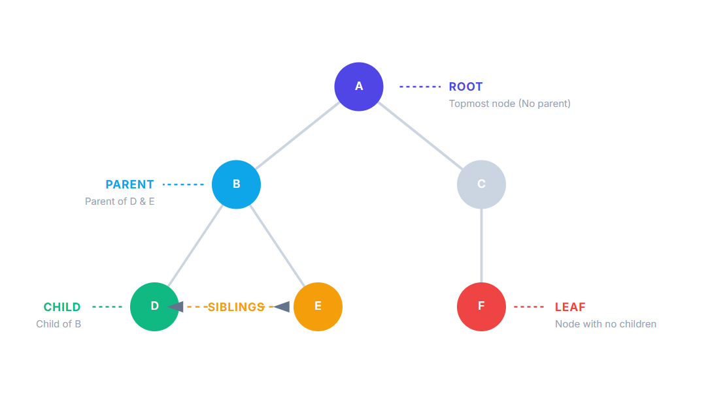
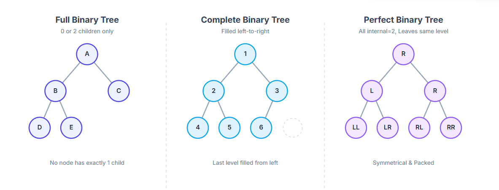
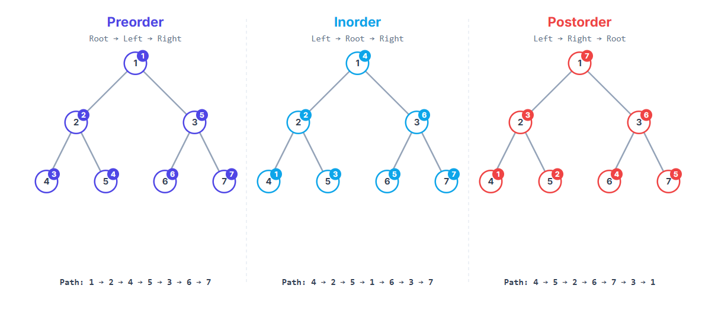

# 🌳 Data Structures: The **Tree** Concept

This repository provides a comprehensive overview of the fundamental concepts related to the **Tree** data structure. A Tree is a non-linear, hierarchical data structure widely used in computer science to represent parent-child relationships and organize data efficiently.

---

## 1. Fundamental Tree Components (Basic Concepts)

| Concept | Definition | Key Insights |
| :--- | :--- | :--- |
| **Tree** | A collection of nodes (Nodes) connected by edges (Edges) that contains no cycles or closed loops. | Every tree has exactly one **Root** node. |
| **Root** | The topmost node in the tree structure, which has no parent. | The starting point for traversing and manipulating the tree. |
| **Node** | The basic entity in the tree that holds data. | Contains a value and pointers to its children nodes. |
| **Edge** | A link or line connecting a parent node to a child node, representing the hierarchical relationship. | A tree with $N$ nodes has exactly $N-1$ edges. |
| **Parent** | A node that is one level above its children nodes and has a direct edge to them. | Every node, except the Root, has exactly one parent. |
| **Child** | A node that is one level below its parent node, branching off from the parent via an edge. |
| **Sibling** | Nodes that share the same parent node. | They are at the same level of the tree. |
| **Degree of a Node** | The number of direct subtrees or, equivalently, the number of children of that node. | For a Leaf node, the degree is zero. |
| **Leaf Node (External Node)** | A node that has no children and is located at the endpoints of the paths. |
| **Internal Node** | A node that has at least one child. | This includes the Root if the tree has more than one node. |

---

## 2. Structural Metrics and Measurements

| Metric | Definition | Calculation and Significance |
| :--- | :--- | :--- |
| **Degree of a Tree** | The maximum degree found among all nodes in the tree. | This value defines the maximum number of children allowed (e.g., maximum 2 for a Binary Tree). |
| **Level** | The distance of a node from the root. (Root is usually at Level **0** or **1**). | If the Root is Level 0, Level is the same as Depth. |
| **Depth** | The length of the path from the **Root** to the node (number of edges). | The depth of the root is 0. |
| **Height** | The length of the longest path from that node to the **deepest Leaf Node** below it. | The **Height of the Tree** is the height of the Root node. |
| **Path** | A sequence of connected nodes, starting from one node and ending at another. | The path length is the number of edges involved. |
| **Ancestor / Descendant** | If node $A$ is on the path from the Root to node $B$, then $A$ is an **Ancestor** of $B$, and $B$ is a **Descendant** of $A$. | The Parent is the immediate Ancestor. |

---

## 3. Tree Classification and Types

| Tree Type | Key Features and Definitions |
| :--- | :--- |
| **Ordered vs Unordered Tree** | **Ordered:** The order of subtrees/children (left/right) matters (**BST**). / **Unordered:** The order of children does not matter. |
| **General Tree** | There is no limit on the number of children a node can have (unlimited degree). |
| **Binary Tree (BT)** | Every node has a maximum of **two children** (a left child and a right child). (Degree $\leq 2$). |
| **Full Binary Tree** | Every non-leaf node has **exactly two children**. |
| **Perfect Binary Tree** | A tree that is both **Full** AND all of its leaf nodes are at the **same level**. | At height $h$, it has exactly $2^{h+1} - 1$ nodes. |
| **Complete Binary Tree** | All levels, except possibly the last, are completely filled, and nodes in the last level are as far **left** as possible. | The underlying structure for the **Heap** data structure. |
| **Skewed Tree** | A tree where every node (except the leaf) has only one child, forming a single path (either all left or all right). |
| **Degenerate Tree** | A Binary Tree where the structure behaves like a **Linked List**. (Each parent node has at most one child.) | Represents the worst-case scenario for performance. |
| **Balanced Tree** | A tree where the height difference between the left and right subtrees of any node does not exceed a small constant (usually 1). | Examples: **AVL** and **Red-Black Tree**. Ensures $O(\log N)$ performance for main operations. |

---

## 4. Tree Traversal

Traversal is the process of visiting every node in the tree structure exactly once in a systematic way. This operation is divided into two main categories:

### A) Breadth-First Search (BFS) Traversal

* **Method:** Visits nodes **level by level** (Layer by Layer), starting from the root and moving downwards.
* **Required Data Structure:** **Queue**.
* **Visit Order:** Level 0 nodes, then Level 1 nodes, and so on.

### B) Depth-First Search (DFS) Traversal

DFS uses recursion or a **Stack** to traverse the tree deeply and has three primary methods:

| DFS Method | Visit Order | Common Application |
| :--- | :--- | :--- |
| **Inorder** | (Left Subtree) $\rightarrow$ **Node** $\rightarrow$ (Right Subtree) | Retrieves elements in **sorted order** in a **Binary Search Tree (BST)**. |
| **Preorder** | **Node** $\rightarrow$ (Left Subtree) $\rightarrow$ (Right Subtree) | Used to create a complete **copy** of the tree structure or express prefix notation. |
| **Postorder** | (Left Subtree) $\rightarrow$ (Right Subtree) $\rightarrow$ **Node** | Used for the safe **deletion** of the tree (from leaves up to the root) and expressing postfix notation. |

